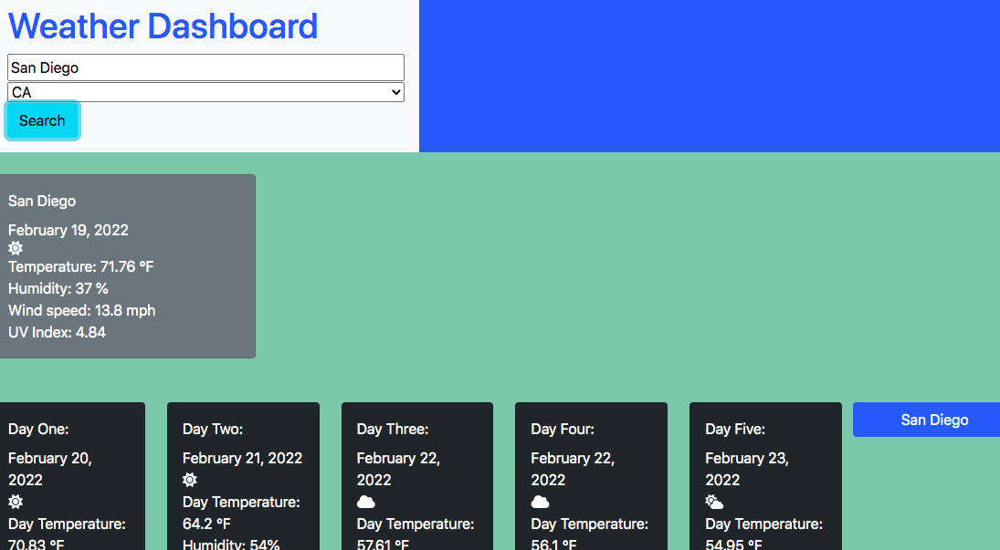

# Weather Dashboard

## Table of Contents

- [Picture](#picture)
- [Description](#description)
- [License](#license)
- [Installation](#installation)
- [Usage](#usage)

## Picture

## Description
This is a front-end only application that allows a user to search a US city and see that city's current and forecasted weather, and repeat recent searches.

## License
None

## Installation
The website can be viewed on a internet browser, or the repository can be forked.

## Usage
The website has no outside links or subpages. The user may type the name of any US city into the search bar and select its corresponding state, and the data will appear. They may repeat their recent searches by clicking the right-hand buttons that pop up with their searches.

## Deployed Application
https://pasfrad.github.io/Homework-6-weather-dashboard/

## For Questions
rd.hart@outlook.com